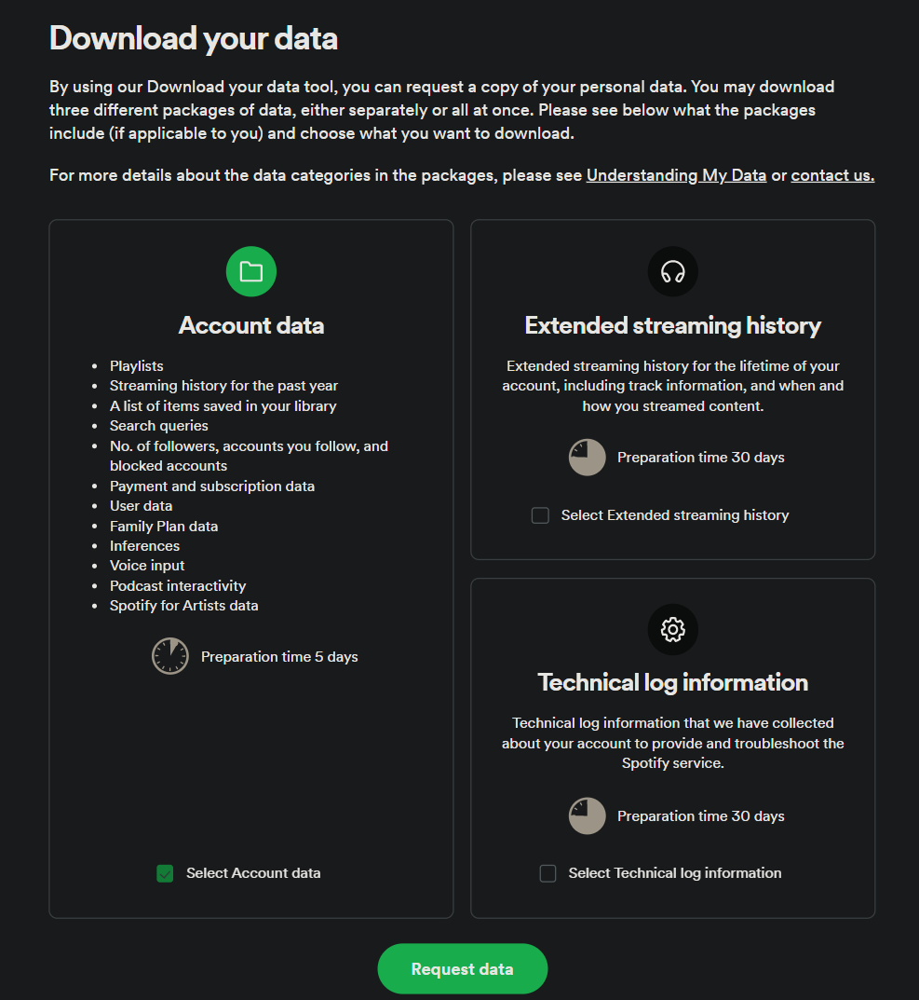
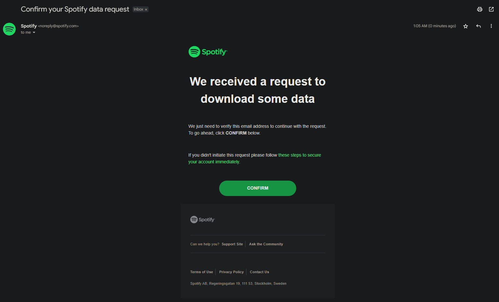
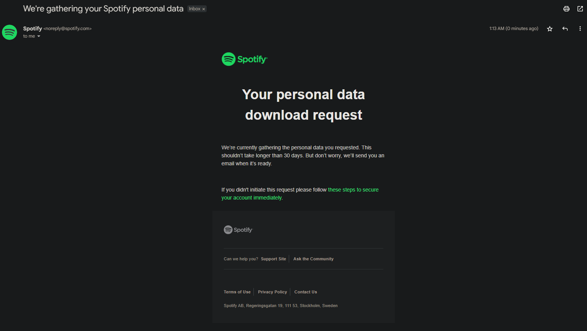
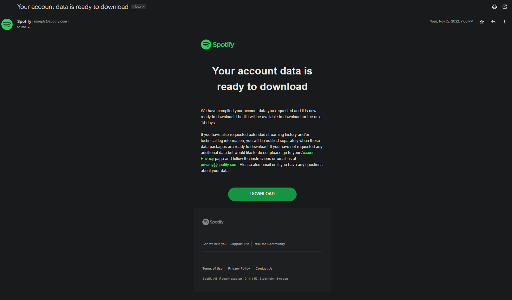

## Spotify Import Guide
 ### **1. Request your data from Spotify**<br>
 In order to request the splitted ```StreamingHistory<x>.json``` files, simply press the correct buttons on the [Spotify](https://open.spotify.com/) website.
   1.  To get started, open the [Privacy page](https://www.spotify.com/account/privacy/) on the Spotify website.
   2.  Scroll down to the "Download your data" section.<br><br>
   <br><br>
   3.  Make sure to only tick the box in the "**Account data**" panel. 
   4.  Press the "Request data" button.
### **2. Confirm your request**<br>
As soon as your request is accepted by Spotify, you'll receive a link to confirm the request in your email. Confirm it, and Spotify will start gathering your data.<br><br>
<br>
Press **Confirm**
### **3. Wait until you receive your data**<br>
<br>
This can take around 5 days. But trust me, worth the wait!♥<br>
### **4. Download and extract the files**<br>
Once your data is ready to download, you'll get an email with a link to download a .ZIP file. You need to extract this file before proceeding. You can learn how to extract .ZIP files [on this page](https://www.youtube.com/watch?v=XAFwU2BQwHE).<br><br>
<br>

### **5. Place them in the json folder**
Place the ```StreamingHistory<x>.json``` files in the json folder(created after cloning this repo). Replace/Delete previously stored json files if necessary.

### **6. Ready to Go!** <br>
**Congratulations**! You can now view your annual listening history, play count, and much more. Click [here](./main.ipynb) to proceed